## Enhanced Data Processing Pipeline

```mermaid
flowchart LR

    %% Input Data
    input_data([Input Data])

    %% Data Input nodes
    csv_reader["CSVReader<br/>csv_reader"]
    json_reader["JSONReader<br/>json_reader"]

    %% Processing nodes
    data_joiner["PythonCode<br/>data_joiner"]
    data_transformer["PythonCode<br/>data_transformer"]
    classifier["PythonCode<br/>classifier"]
    aggregator["PythonCode<br/>aggregator"]

    %% Data Output nodes
    csv_writer["CSVWriter<br/>csv_writer"]
    json_writer["JSONWriter<br/>json_writer"]

    %% Output Data
    output_data([Output Data])

    %% Flow
    input_data --> csv_reader
    input_data --> json_reader
    csv_reader -->|data→customer_data| data_joiner
    json_reader -->|data→transaction_data| data_joiner
    data_joiner -->|data→data| data_transformer
    data_transformer -->|data→data| classifier
    classifier -->|data→data| aggregator
    classifier -->|data→data| csv_writer
    aggregator -->|metrics→data| json_writer
    csv_writer --> output_data
    json_writer --> output_data

    %% Styling
    style input_data fill:#e3f2fd,stroke:#1565c0,stroke-width:2px,stroke-dasharray: 5 5
    style output_data fill:#e3f2fd,stroke:#1565c0,stroke-width:2px,stroke-dasharray: 5 5
    style csv_reader fill:#e1f5fe,stroke:#01579b,stroke-width:2px
    style json_reader fill:#e1f5fe,stroke:#01579b,stroke-width:2px
    style data_joiner fill:#fffde7,stroke:#f57f17,stroke-width:2px
    style data_transformer fill:#fffde7,stroke:#f57f17,stroke-width:2px
    style classifier fill:#fffde7,stroke:#f57f17,stroke-width:2px
    style aggregator fill:#fffde7,stroke:#f57f17,stroke-width:2px
    style csv_writer fill:#f3e5f5,stroke:#4a148c,stroke-width:2px
    style json_writer fill:#f3e5f5,stroke:#4a148c,stroke-width:2px
```

### Nodes

| Node ID | Type | Description |
|---------|------|-------------|
| aggregator | PythonCodeNode | Node for executing arbitrary Python code. |
| classifier | PythonCodeNode | Node for executing arbitrary Python code. |
| csv_reader | CSVReaderNode | Reads data from CSV files with automatic header detection and type inference. |
| csv_writer | CSVWriterNode | Writes data to a CSV file. |
| data_joiner | PythonCodeNode | Node for executing arbitrary Python code. |
| data_transformer | PythonCodeNode | Node for executing arbitrary Python code. |
| json_reader | JSONReaderNode | Reads data from a JSON file. |
| json_writer | JSONWriterNode | Writes data to a JSON file. |

### Connections

| From | To | Mapping |
|------|-----|---------|
| csv_reader | data_joiner | data→customer_data |
| json_reader | data_joiner | data→transaction_data |
| data_joiner | data_transformer | data→data |
| data_transformer | classifier | data→data |
| classifier | aggregator | data→data |
| classifier | csv_writer | data→data |
| aggregator | json_writer | metrics→data |
