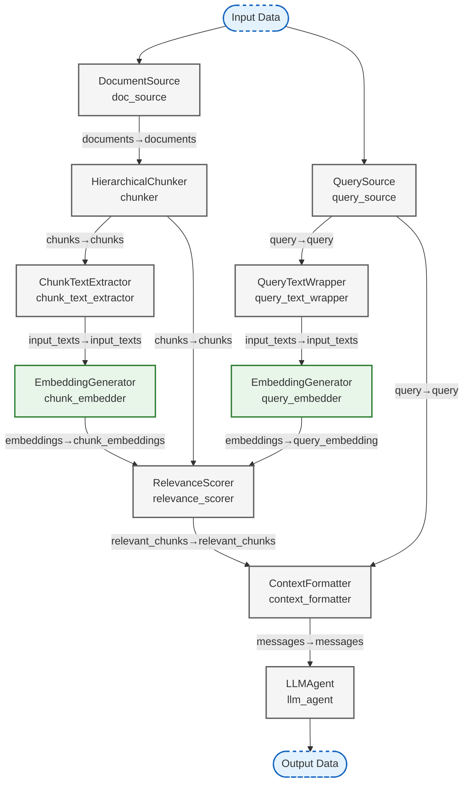

## Hierarchical RAG Workflow

_Simple hierarchical RAG workflow using LLMAgentNode and EmbeddingGeneratorNode with Ollama_

### Nodes

| Node ID | Type | Description |
|---------|------|-------------|
| chunk_embedder | EmbeddingGeneratorNode | Vector embedding generator for RAG systems and semantic similarity operations. |
| chunk_text_extractor | ChunkTextExtractorNode | Extracts text content from chunks for embedding generation. |
| chunker | HierarchicalChunkerNode | Splits documents into hierarchical chunks for better retrieval. |
| context_formatter | ContextFormatterNode | Formats relevant chunks into context for LLM. |
| doc_source | DocumentSourceNode | Provides sample documents for hierarchical RAG processing. |
| llm_agent | LLMAgentNode | Advanced Large Language Model agent with LangChain integration and MCP |
| query_embedder | EmbeddingGeneratorNode | Vector embedding generator for RAG systems and semantic similarity operations. |
| query_source | QuerySourceNode | Provides sample queries for RAG processing. |
| query_text_wrapper | QueryTextWrapperNode | Wraps query string in list for embedding generation. |
| relevance_scorer | RelevanceScorerNode | Scores chunk relevance using various similarity methods including embeddings similarity. |

### Connections

| From | To | Mapping |
|------|-----|---------|
| doc_source | chunker | documents→documents |
| chunker | chunk_text_extractor | chunks→chunks |
| chunker | relevance_scorer | chunks→chunks |
| query_source | query_text_wrapper | query→query |
| query_source | context_formatter | query→query |
| chunk_text_extractor | chunk_embedder | input_texts→input_texts |
| query_text_wrapper | query_embedder | input_texts→input_texts |
| chunk_embedder | relevance_scorer | embeddings→chunk_embeddings |
| query_embedder | relevance_scorer | embeddings→query_embedding |
| relevance_scorer | context_formatter | relevant_chunks→relevant_chunks |
| context_formatter | llm_agent | messages→messages |
