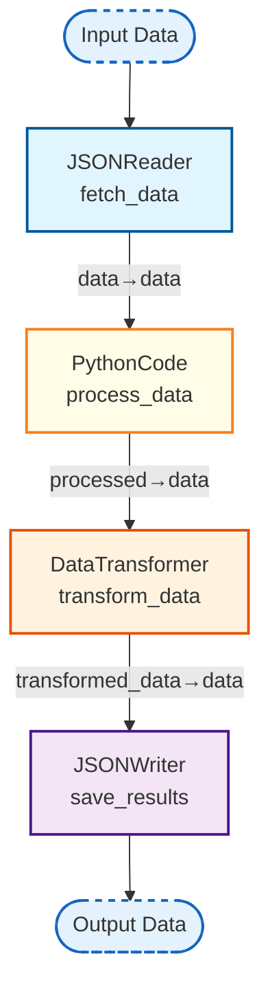

## API Integration Workflow

_Demonstrates API data fetching and processing_

### Nodes

| Node ID | Type | Description |
|---------|------|-------------|
| fetch_data | JSONReader | Reads data from a JSON file. |
| process_data | PythonCodeNode | Node for executing arbitrary Python code. |
| save_results | JSONWriter | Writes data to a JSON file. |
| transform_data | DataTransformer | Transforms data using custom transformation functions provided as strings. |

### Connections

| From | To | Mapping |
|------|-----|---------|
| fetch_data | process_data | data→data |
| process_data | transform_data | processed→data |
| transform_data | save_results | transformed_data→data |
