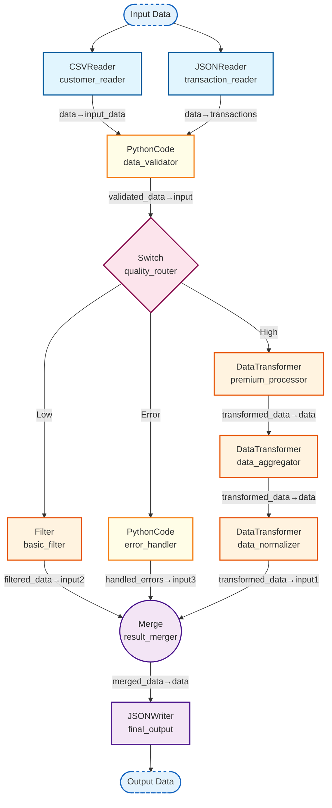

## Complex Processing Pipeline

_A sophisticated workflow with conditional routing and API integration_

### Nodes

| Node ID | Type | Description |
|---------|------|-------------|
| basic_filter | Filter | Filters data based on a condition. |
| customer_reader | CSVReader | Reads data from a CSV file. |
| data_aggregator | DataTransformer | Transforms data using custom transformation functions provided as strings. |
| data_normalizer | DataTransformer | Transforms data using custom transformation functions provided as strings. |
| data_validator | PythonCodeNode | Node for executing arbitrary Python code. |
| error_handler | PythonCodeNode | Node for executing arbitrary Python code. |
| final_output | JSONWriter | Writes data to a JSON file. |
| premium_processor | DataTransformer | Transforms data using custom transformation functions provided as strings. |
| quality_router | Switch | Routes data to different outputs based on conditions. |
| result_merger | Merge | Merges multiple data sources. |
| transaction_reader | JSONReader | Reads data from a JSON file. |

### Connections

| From | To | Mapping |
|------|-----|---------|
| customer_reader | data_validator | data→input_data |
| transaction_reader | data_validator | data→transactions |
| data_validator | quality_router | validated_data→input |
| quality_router | premium_processor | case_high→data |
| quality_router | basic_filter | case_low→data |
| quality_router | error_handler | case_error→data |
| premium_processor | data_aggregator | transformed_data→data |
| basic_filter | result_merger | filtered_data→input2 |
| error_handler | result_merger | handled_errors→input3 |
| data_aggregator | data_normalizer | transformed_data→data |
| data_normalizer | result_merger | transformed_data→input1 |
| result_merger | final_output | merged_data→data |
