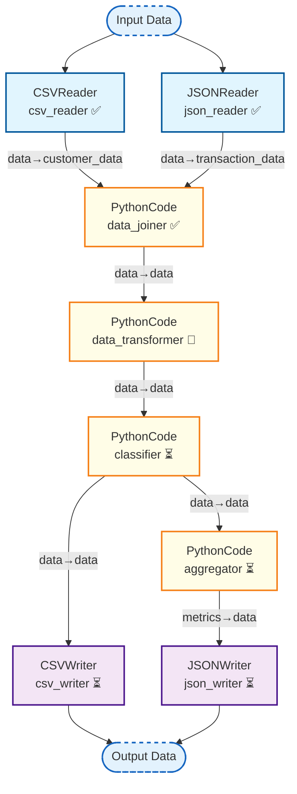

# Workflow Execution Status

**Run ID**: `4cfc6321-4a49-4733-8ab6-4927f8212401`  
**Workflow**: data_processing_pipeline  
**Timestamp**: 2025-05-30 13:18:45.778439+00:00

## Execution Diagram

## Status Legend

| Status | Symbol | Description |
|--------|--------|-------------|
| Pending | ⏳ | Task is waiting to be executed |
| Running | 🔄 | Task is currently executing |
| Completed | ✅ | Task completed successfully |
| Failed | ❌ | Task failed during execution |
| Skipped | ⏭️ | Task was skipped |

## Task Details

| Node ID | Status | Start Time | End Time | Duration |
|---------|--------|------------|----------|----------|
| aggregator | pending ⏳ | N/A | N/A | N/A |
| csv_reader | completed ✅ | N/A | N/A | N/A |
| data_transformer | running 🔄 | N/A | N/A | N/A |
| json_writer | pending ⏳ | N/A | N/A | N/A |
| data_joiner | completed ✅ | N/A | N/A | N/A |
| json_reader | completed ✅ | N/A | N/A | N/A |
| classifier | pending ⏳ | N/A | N/A | N/A |
| csv_writer | pending ⏳ | N/A | N/A | N/A |
