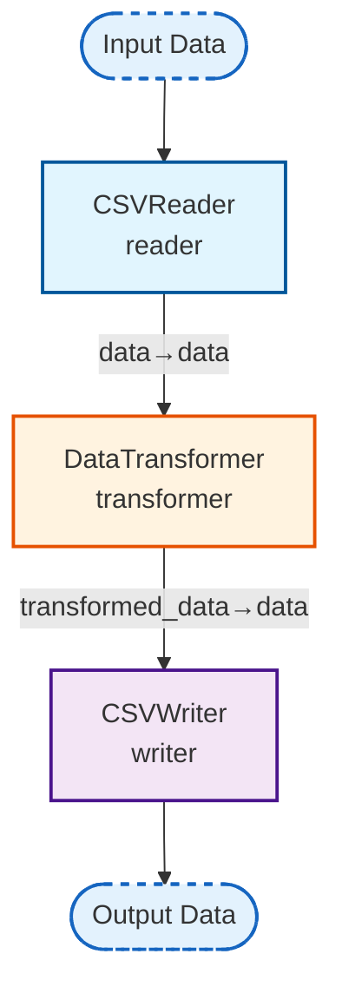

## Simple ETL Pipeline Visualization

_A basic Extract-Transform-Load workflow_

### Nodes

| Node ID | Type | Description |
|---------|------|-------------|
| reader | CSVReader | Reads data from a CSV file. |
| transformer | DataTransformer | Transforms data using custom transformation functions provided as strings. |
| writer | CSVWriter | Writes data to a CSV file. |

### Connections

| From | To | Mapping |
|------|-----|---------|
| reader | transformer | data→data |
| transformer | writer | transformed_data→data |
