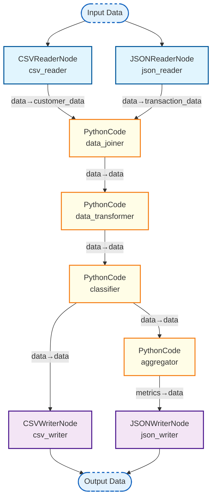
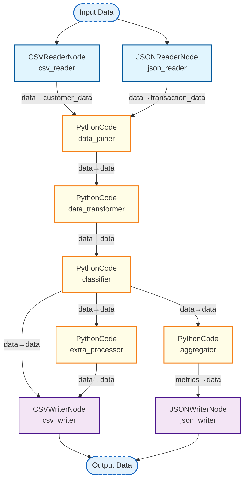

# Workflow Comparison

This document compares two versions of a data processing workflow.

## Workflow v1 - Original

## Workflow v2 - Enhanced with Extra Processor

## Changes Summary

- **Added**: `extra_processor` node between `classifier` and `csv_writer`
- **Purpose**: Additional processing step for data enhancement
- **Impact**: Data now goes through an extra transformation before being written to CSV
