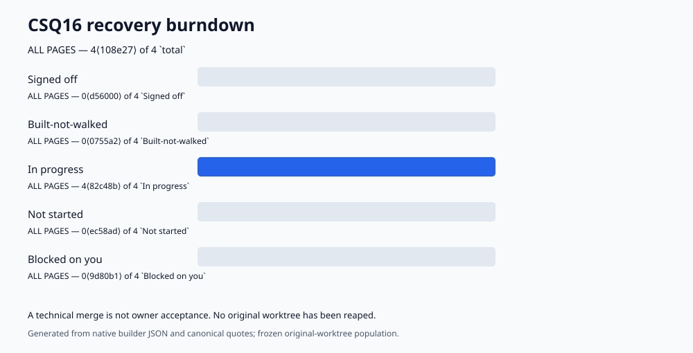

# CSQ16 recovery burndown

Generated from the frozen recovery register. Technical landing and cleanup evidence is tracked separately in the work ledger; owner signoff is not inferred from a merge.

<!-- BURNDOWN:BEGIN generated by .claude/bin/burndown-build.mjs — DO NOT EDIT BY HAND -->
## Burndown

These are the only counts. Any figure quoted anywhere is this block verbatim, or it is wrong.

Status vocabulary (CLOSED — a value outside this set is a build refusal, exit 2):

- `Signed off` — the owner has accepted it. The ONLY status that counts toward completion.
- `Built-not-walked` — built, not yet walked through with the owner. NOT complete.
- `In progress` — actively being worked.
- `Not started` — accepted into the register, no work begun.
- `Blocked on you` — waiting on the owner; cannot proceed here.
- `Open` — DERIVED, not assignable: `total` − `Signed off`.

`done`, `complete`, `closed`, `finished` and `remaining` are NOT count labels here. Each named at least two different buckets in prior reports, which is why the generator refuses them.

Every column below is a BUCKET and every row states its DENOMINATOR in `total`. A figure quoted without both is not a figure from this block.

Each count is rendered `value⟨token⟩`. The token is derived from that count's own bucket, denominator, value and source digest, so a quoted figure is TAMPER-EVIDENT: change any of them and the token stops validating. Quote the token with the number — `burndown-build.mjs --quote <bucket>` prints a paste-ready sentence, and `--verify-quote <file|->` revalidates any text containing them.

| page | total | Signed off | Built-not-walked | In progress | Not started | Blocked on you | Open | Open: from original register | Open: arrived since |
| --- | --- | --- | --- | --- | --- | --- | --- | --- | --- |
| CSQ16 recovery | 4⟨290bde⟩ | 0⟨fe7237⟩ | 0⟨b4f70a⟩ | 4⟨bce6c4⟩ | 0⟨103131⟩ | 0⟨b6f9a4⟩ | 4⟨93f445⟩ | 4⟨f957f1⟩ | 0⟨fa731b⟩ |
| **ALL PAGES** | **4⟨108e27⟩** | **0⟨d56000⟩** | **0⟨0755a2⟩** | **4⟨82c48b⟩** | **0⟨ec58ad⟩** | **0⟨9d80b1⟩** | **4⟨f97d03⟩** | **4⟨15d450⟩** | **0⟨5c0bc1⟩** |

A page is complete only when `Signed off` equals `total`. No page is complete: CSQ16 recovery is 0 of 4.

generated_from_sha: 4c817d0bc8de1485fd4603f2cacd0335a0af2ade
sources_digest: afad6aec1570e1d13ebfb57039abaecba3d7de891b9110786e532120f69cd24d

<!-- BURNDOWN:END -->
